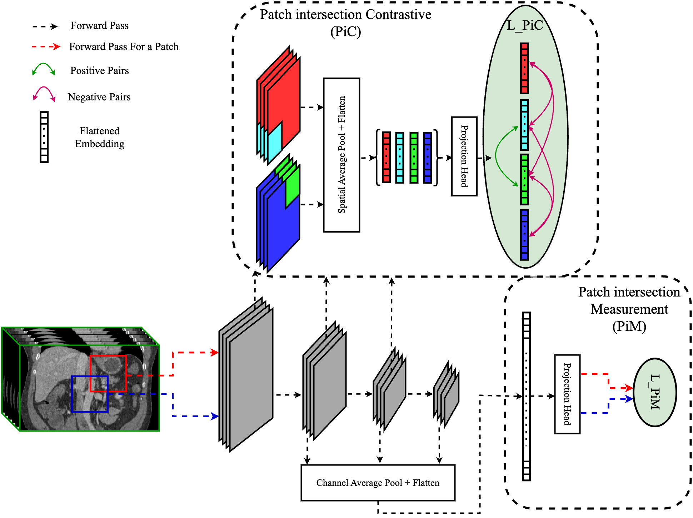

# PiMPiC: A Self-supervised Learning Framework for 3D Patch-based Medical Image Segmentation

This is the official implementation of the paper, **<u>PiMPiC: A Self-supervised Learning Framework for 3D Patch-based Medical Image Segmentation</u>**.


The framework comprises two primary modules: Patch Intersection Module (PiM) and Patch Intersection Contrastive Module (PiC). PiM predicts the overlap between two random patches by analyzing their projected embeddings. PiC employs a contrastive loss to align embeddings of intersecting regions while distinguishing non-intersecting regions. A 3D U-Net encoder serves as the backbone for feature extraction.




# **User Guide**

## **1. Clone the Repository and Install Dependencies**
First, clone the repository and install the required dependencies:

```sh
pip install -r requirements.txt
```

## **2. Dataset Preparation**
If you are working with a **new dataset**, you must update the `config.yaml` file. This includes:
- Adjusting dataset preprocessing settings.
- Specifying the correct data directories.

Ensure the paths and configurations are correctly set before proceeding.

---

## **3. Pretraining the Encoder**
Before training a segmentation model, you must **pretrain the encoder** using our framework.
### **Input Arguments for Encoder Pretraining**
| Argument      | Description |
|--------------|------------|
| `--method`   | Training method. For contrastive learning pretraining, set this to **`cl`**. |
| `--cl_method` | Type of contrastive learning method. Options: `pim`, `pic`, `pimpic`. |

---

### **Pretraining Command:**
```sh
python3 train.py --method=cl --cl_method=pimpic
```

## **4. Training a 3D Patch-Based Segmentation Model**
Once the encoder is pretrained, you can train a **3D patch-based segmentation model** using the same `train.py` script.

### **Input Arguments for Segmentation Training**
| Argument      | Description |
|--------------|------------|
| `--method`   | Training method. For segmentation, set this to **`seg`**. |
| `--seg_method` | Initialization method for the segmentation model. Options: `random`, `pim`, `pic`, `pimpic`. |


### **Segmentation Training Command:**
```sh
python3 train.py --method=seg --seg_method=pimpic
```

## **5. Test the segmentation algorithm**
Although after training each model, the Dice value for the test set will be calculated and stored in the `results` directory, you can modify the test process using `test.py` for further assessments.

### **Input Arguments for Segmentation Testing**
| Argument      | Description |
|--------------|------------|
| `--train_percentage`   | percentage of training data (5, 10, 20, 50, 100). |
| `--seg_method` | Initialization method for the segmentation model. Options: `random`, `pim`, `pic`, `pimpic`. |

```sh
python3 test.py --train_percentage=5 --seg_method=pimpic
```